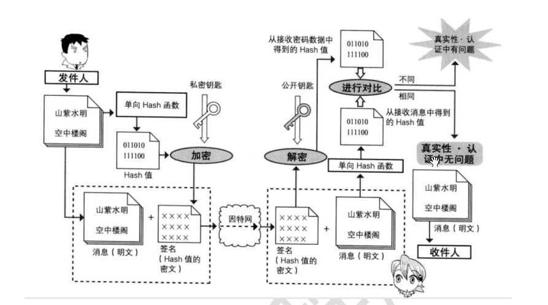

#加密

##消息摘要

md5：登录注册
sha1：Secure Hash Algorithm 安全哈希算法

md5加盐：对MD5摘要结果掺入其他信息，称之为加盐

##对称加密
* 不足：只有一个秘钥，秘钥暴露，文件泄露
* 优点：可以加密大文件，加密速度快
* 代表算法：des,aes
* 密码可以自已指定

aes：advanced encrypt Standard，更高级的方式
des:Data Encrypt Standard，数据加密标准

##非对称加密

* 加密算法：RSA
* 特点：
	* 秘钥对：私钥和公钥，秘钥对不是指定的，系统生成的
	* 私钥自己保留，公钥可以给别人
	* 公钥加密、使用解密
	* 私钥加密、公钥解密
	* 公钥互换：两个组织或者两个人互换公钥
	* 数字签名：验证所属关系（验证私钥在哪里，举例：比如使用支付宝支付，支付宝它会有我们的公钥）
	
	

##安全保证

用户密码：
1.md5:加密多次+盐
2.用公钥加密
3.加上时间戳：需要使用RSA公钥加密
timespan
--
4.将公钥存到服务器(有问题)

